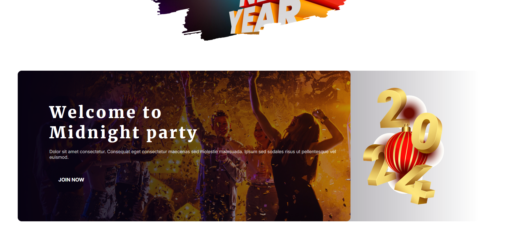

# New Year Mission

**Original Design gathered from:** <br>
<https://github.com/ProgrammingHero1/B9A1-New-Year-New-Mission>


**Goal:**
- [x] Finish header section.
- [ ] Finish middle/main section.
- [ ] Finish footer section.


**Live View** <br>
<https://new-year-mission-fed03.netlify.app/>

**Issues:**
 1. While zoom out or in lerger display, some of images got smaller and background gradient appear vissible. 
 Example: 
 

 2. **How to create Circle** 
 HTML Code:
 ```html
 <div class="circle">
    <div class="inner"></div>
</div>
 ```
 CSS Code:
 ```css
 .circle {
    height: 200px;
    width: 200px;
    background-color: aquamarine;
    border-radius: 50%;
    border: 10px solid rebeccapurple;
}
.inner {
    height: 150px;
    width: 150px;
    background-color: blue;
    border-radius: 50%;
    margin-top: 25px;
    margin-left: 25px; 
}
 ```